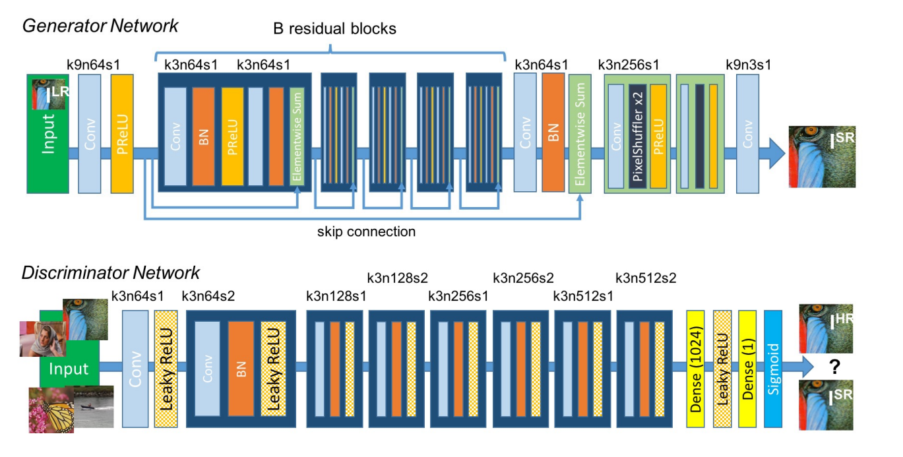

# Image Super Resolution

Advanced Algorithems Project

Professor: Dr. Farnaz Sheikhi

---

### What is Image Super Resulotion?

Image super-resolution reconstruction refers to a technique of recovering a high-resolution (HR) image from a low-resolution (LR) degraded image

---

## Implementation

This implementaion is based on [ESRGAN](https://arxiv.org/abs/1809.00219)

## Datasets
- [DIV2K](https://data.vision.ee.ethz.ch/cvl/DIV2K/) ~4GB
- [Flickr2K](https://cv.snu.ac.kr/research/EDSR/Flickr2K.tar) ~20GB